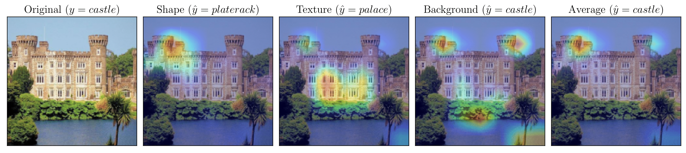
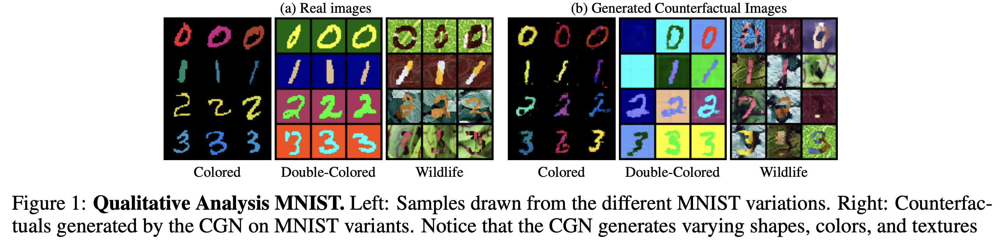
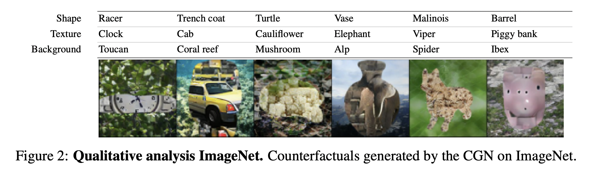
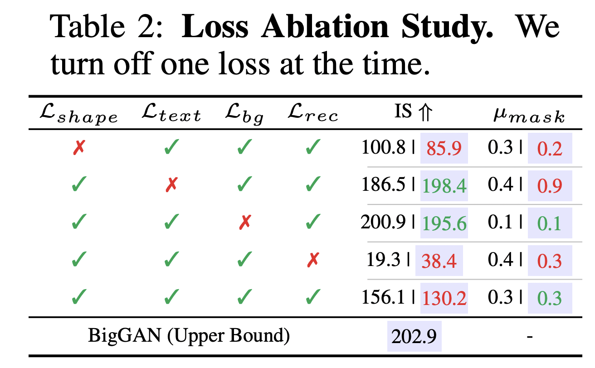
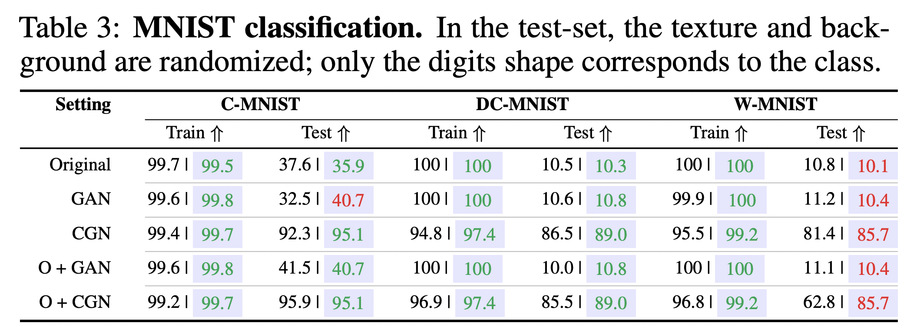
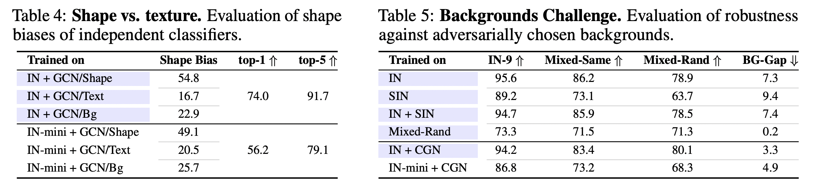
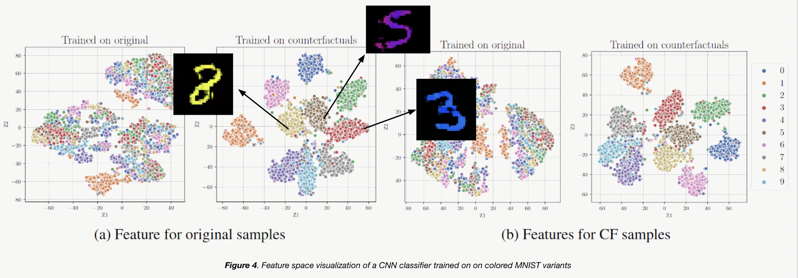

<!-- Template source: https://github.com/paperswithcode/releasing-research-code -->
<!-- >📋  A template README.md for code accompanying a Machine Learning paper -->

# Replication of Counterfactual Generative Networks

This repository is a replication implementation of [Counterfactual Generative Networks](https://arxiv.org/abs/2030.12345) as part of the ML [Reproducibility Challenge 2021](https://paperswithcode.com/rc2021). 

<!-- >📋  Optional: include a graphic explaining your approach/main result, bibtex entry, link to demos, blog posts and tutorials -->


*GradCAM-based heatmap visualized for shape, texture and background heads of CGN ensemble classifier for a sample image from ImageNet-mini. $y$ denotes the original label while $\hat{y}$ denotes the predicted label by each of the three heads.*

## Setup and Requirements

Clone the repository:
```sh
git clone git@github.com:anonymous-user-256/mlrc-cgn.git
cd fact-team3
```

Depending on whether you have a CPU/GPU machine, install a `conda` environment:

```setup
conda env create --file cgn_framework/environment-gpu.yml 
conda activate cgn-gpu
```

<!-- >📋  Describe how to set up the environment, e.g. pip/conda/docker commands, download datasets, etc... -->

## Demo Notebook

A demo notebook that contains code to regenerate all the key reproducibility results that are presented in our paper is included in this repository. It also contains the code to download the datasets and model weights.

Start a `jupyterlab` session using `jupyter lab` and run the notebook [`experiments/final-demo.ipynb`](./experiments/final-demo.ipynb).

<!-- It takes about about 90 minutes to run the complete notebook. It shall take longer if you decide to pass `ignore_cache=True` to the notebook which will re-run all the experiments from scratch rather than use cached results/models. -->


## Results

### Reproducibility study

**Claim 1: Generation of high-quality counterfactuals**

We qualitatively evaluate the counterfactual samples generated by a CGN on variants of MNIST and ImageNet dataset.





**Claim 2: Inductive bias requirements**

We replicate the experiment for loss ablation to verify if all inductive biases (e.g. losses) are indeed necessary for generating high-quality counterfactuals. The numbers in shaded cells (beside the reported numbers) denote the numbers borrowed from the original paper.

<p align="center">

</p>

**Claim 3: Out-of-distribution robustness**

We evaluate how well can classifiers trained with counterfactual samples generalize to out-of-distribution datasets.

For MNISTs, we evaluate on colored MNIST, double colored MNIST and wildlife MNIST.

<p align="center">

</p>

For ImageNet, due to resource constraints, we evaluate on ImageNet-mini. Replicating the paper, we do two experiments: (i) evaluating shape and texture bias of counterfactually trained classifier (Table 4), (ii) testing if such a classifier shows background invariance (Table 5).

<p align="center">

</p>


### Additional experiments and extensions

We conduct additional experiments and analysis to further investigate the main claims of the paper. A sample feature visualization for a classifier trained on original data vs that on counterfactual data is shown below. Kindly refer to the paper for more details and more such analyses.



*Interestingly, digits 3-5-8 are similar in shape and their clusters are closer together as well. This strengthens the intuition that the classifier actually ignoring spurious correlation (digit color) and focusing on causal correlation (digit shape).*

<!-- ## Training

To train the model(s) in the paper, run this command:

```train
python train.py --input-data <path_to_data> --alpha 10 --beta 20
```

>📋  Describe how to train the models, with example commands on how to train the models in your paper, including the full training procedure and appropriate hyperparameters.
## Evaluation

To evaluate my model on ImageNet, run:

```eval
python eval.py --model-file mymodel.pth --benchmark imagenet
```

>📋  Describe how to evaluate the trained models on benchmarks reported in the paper, give commands that produce the results (section below).
## Pre-trained Models

You can download pretrained models here:

- [My awesome model](https://drive.google.com/mymodel.pth) trained on ImageNet using parameters x,y,z. 

>📋  Give a link to where/how the pretrained models can be downloaded and how they were trained (if applicable).  Alternatively you can have an additional column in your results table with a link to the models. -->

<!-- ## Results -->
<!-- 
Our model achieves the following performance on :

### [Image Classification on ImageNet](https://paperswithcode.com/sota/image-classification-on-imagenet)

| Model name         | Top 1 Accuracy  | Top 5 Accuracy |
| ------------------ |---------------- | -------------- |
| My awesome model   |     85%         |      95%       |

>📋  Include a table of results from your paper, and link back to the leaderboard for clarity and context. If your main result is a figure, include that figure and link to the command or notebook to reproduce it.  -->

<!-- ## Contributing

>📋  Pick a licence and describe how to contribute to your code repository. -->

## Acknowledgements

* Template source: https://github.com/paperswithcode/releasing-research-code
* The authors of the original CGN paper: Axel Sauer and Andreas Geiger
